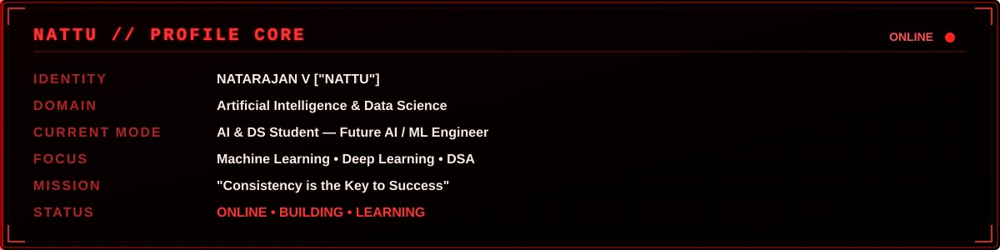

 

 

 

### `TECH STACK`

**LANGUAGES**

**AI / MACHINE LEARNING**

**DEEP LEARNING**

**DATA SCIENCE**

**DATABASES**

**WEB DEVELOPMENT**

**FRAMEWORKS**

**DEVOPS**

**DEV TOOLS**

**CORE SKILLS**

### `SOCIAL // COMMUNICATION CHANNELS`

 

 

<table width="100%">
<tr>

<td width="100%" valign="top">

</td>
</tr>
</table>
 

 

 

- `RANK` **2,057,436**  
- `LANGUAGES USED` **Java · Python**
- `LATEST BADGE` **50 Days Badge 2026**

### `CURRENT MISSION`

<table width="100%">
<tr><td width="30%"><b>CURRENTLY LEARNING</b></td><td>Machine Learning · Data Structures &amp; Algorithms</td></tr>
<tr><td><b>CURRENTLY BUILDING</b></td><td>Machine learning projects · Real-world &amp; personal builds</td></tr>
<tr><td><b>CURRENTLY EXPLORING</b></td><td>Artificial Intelligence · Deep Learning · AI Engineering · Practical model building</td></tr>
<tr><td><b>NEXT TARGET</b></td><td>Become a highly skilled AI / ML Engineer by strengthening programming, mathematics, data analysis, machine learning, deep learning, and real-world project development</td></tr>
<tr><td><b>PHILOSOPHY</b></td><td><i>"Learn deeply. Build consistently. Solve intelligently. Improve continuously."</i></td></tr>
</table>

#              Consistency is the Key to Success...!

